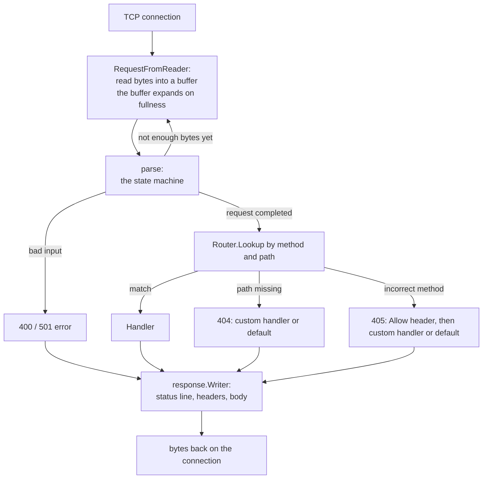
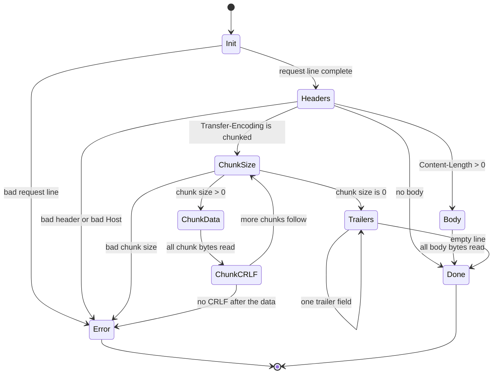

# Architecture & Internals

In this document we discuss the architecture and internals of the `httpfromtcp` server, including the request flow, state machine parsing, and trie routing.

## Package Structure

| Package              | Description                                              |
| -------------------- | -------------------------------------------------------- |
| `internal/request`   | The request parser and its resumable state machine.      |
| `internal/headers`   | Header map, quoted-string parsing, and parameters.       |
| `internal/url`       | Percent decoding, path/query split, host checking.       |
| `internal/response`  | The bufferd response writer and chunked encoding.        |
| `internal/router`    | The trie router, rolling hash, and diagnostics errors.   |
| `internal/server`    | TCP listener, timeout handling, and handler interface.   |
| `internal/diagnostics| Errors formatting with source lines and `^` annotations.|  
| `cmd/httpserver`     | Example server executable showing how to use this code. |

## The Request Flow

Here is the request flow of one request, from bytes on the socket to the response.



## The Parser State Machine

Parser allows partial data to be provided. Each state consumes the number of bytes it can consume and returns the count. The caller retains the rest to use for further reading in the future.



The server increases the read buffer size on-the-fly to handle large requests. The client gets `400 Bad Request` if its syntax is broken (for example, contains encoded NUL bytes or duplicate `Host` header), and `501 Not Implemented` for an unknown transfer encoding.

---

## The Router

The router is a Trie that associates methods and path patterns with a `router.Handler`.

### Segment Types

| Type        | Pattern     | Description of matching                        |
| ----------- | ---------- | ---------------------------------------------- |
| Static      | `/users`   | Exactly the string `users`                     |
| Param       | `/{id}`    | Single param segment with any value           |
| Wildcard    | `/*path`   | All remaining path segments                   |

**Routing Rules:**
1. Static segment always beats param segment.
2. Param segment always beats wildcard segment.
3. If a failure occurs deeper in the route branch traversal, the router traverses backwards and attempts the next type of segment.

There are two types of indexes that have static segments: Go map (`New`) and hash table where polynomial rolling hash is used (`NewHashed`). To avoid the problem of hash collision errors, the table compares string values in full when the hashes collide.

### Diagnostic Error Messages

Package `internal/diagnostic` presents routing registration error messages similarly to the Rust compiler: byte offset calculation without repeating the pattern search:

```text
error: wildcard segment must be last
  --> main.go:170
  |
  | /httpbin/*path/edit
  |          ^^^^^
  |
  = help: wildcard segments must be the final segment
```

---

## Chunked Transfer Encoding

Server reads and writes chunked bodies natively. Decoder supports gracefully splitting reads, stopping even in the middle of reading hex size.

Chunked response may be written using the buffered writer:
```go
w.WriteChunkedBody(data)     // one chunk per call
w.WriteChunkedBodyDone()     // ending 1: no trailers
w.WriteTrailers(trailers)    // ending 2: trailer fields
```

---

## Middleware & Handlers

A middleware chain for a route is constructed **only once**, during startup. Thus the chain wraps the dispatch, so:
* `404` and `405` responses will be subject to middleware execution.
* Middlewares are applied globally.

- `ServeHTTP` invokes the chain, binding parameters prior to invoking the last handler.

---
## Security & Safety

### Framing Rules & Mitigation of Request Smuggling
Indefinite framing allows the attacker to smuggle two requests into a single message. The server refuses such messages prior to consuming the body:
- `Transfer-Encoding` + `Content-Length` -> `400`
- Double/mismatched `Content-Length` headers -> `400`
- `chunked` is not the last coding -> `400`

### Memory & Size Limits
The server provides two strict Timeouts (`ReadTimeout`, `WriteTimeout`) with default `10` seconds and eight different size limits in order to avoid memory exhaustion.

| Limit            | Default  | Response Code |
| ---------------- | -------- | ------------- |
| Request Line     | 8 KiB    | `414`         |
| Headers / Buffer | 8 KiB    | `431`         |
| Body / Trailers  | 10 MiB   | `413`         |

*Remark: The parser checks the limits prior to keeping the bytes, preventing the malicious request from taking infinite memory.*

### Timeouts & Deadlines
The server implements strict socket deadlines to prevent resource exhaustion:
- **`ReadTimeout`:** Calculates the time interval between connection establishing and ending the request. If the client takes too much time to send the request, the parser stops working and the server responds with `408 Request Timeout`.
- **`WriteTimeout`:** Represents the interval between the end of the request and the end of the response.
*Note: Write timeout includes the time that the request spends within the handler, behaving similarly to Go's native `net/http` package.*

### Graceful Shutdown
The server offers two shutdown methods that take into account the active connections using an internal map and a `sync.WaitGroup`:
**`Close()`:** Halt immediately the listener and cancel all active requests.
**`Shutdown(ctx)`:** Close the listener and stop accepting new requests and wait for the active handlers to complete. In case the `ctx` provided is expired before the handlers finish, all remaining connections will be canceled.

### Safe Response Defaults
**No Sniffing:** Every error response comes with `X-Content-Type-Options: nosniff` to protect against browser MIME sniffing.
**No Server Header:** The server intentionally does not provide the `Server` header in order to keep safe from attacks.
**Content Types:** Error responses use safely escaped `text/plain; charset=utf-8` content types by default.
