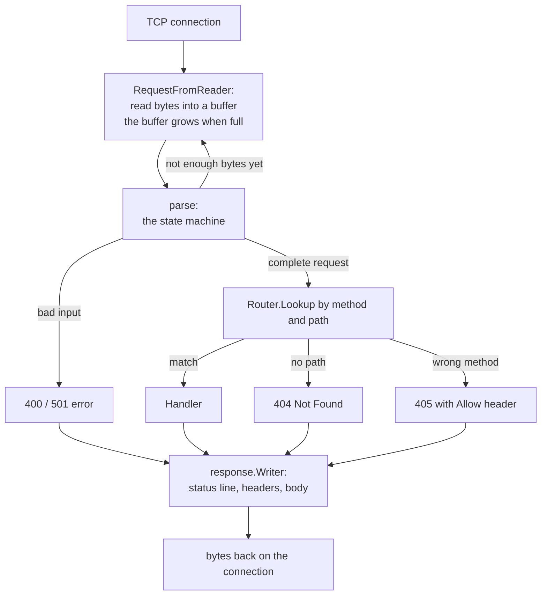
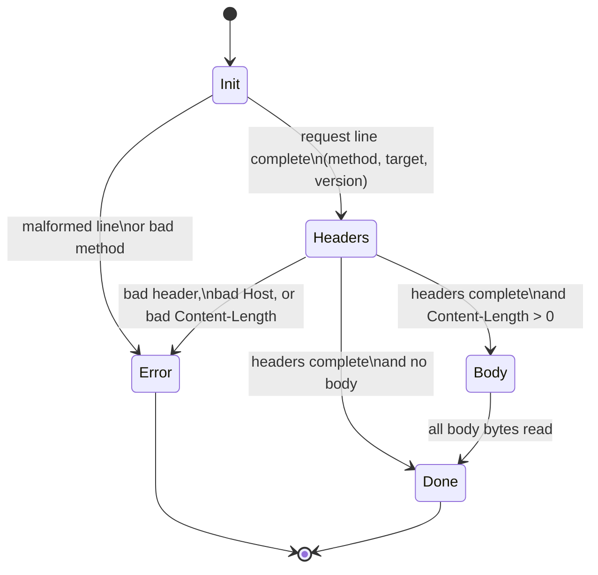

# httpfromtcp
[](https://github.com/rllko/httpfromtcp/actions/workflows/go.yml)

An HTTP/1.1 server that runs on raw TCP sockets. The project uses only the Go standard library. It has no external dependencies.

> **Note:** This document shows the completed project. Two parts are not complete at this time: the decoder for chunked request bodies, and the option functions that connect the router to the server. See [Project status](#project-status) for the status of each part.

> **Note:** This is a project for study. Do not use this server in production.

## Project status

Done:

- [x] Resumable HTTP/1.1 request parser (request line, headers, body, done, error states)
- [x] Percent-decoding of the request target, quoted-strings, and header parameters
- [x] Host validation for IPv4, IPv6, and registered names
- [x] Strict `Content-Length` parsing
- [x] Trie router with static, `:param`, and `*wildcard` segments
- [x] Polynomial rolling-hash index with a benchmark against a Go map
- [x] Chunked response writer
- [x] Test suite: split-read, malformed-input, end-to-end, differential, and collision tests

Not done yet:

- [ ] **Chunked request-body decoder.** The server refuses a request with `Transfer-Encoding` with a `501` response. The decoder must resume across split reads (mid-size-line, mid-data, mid-CRLF).
- [ ] **Router wiring with interfaces and functional options.**

## What the project does

The server reads bytes from a TCP connection. The parser changes these bytes into an HTTP request. The router finds the correct handler for the request. The handler writes an HTTP response back to the connection.

The parser obeys RFC 9110 and RFC 9112. The parser accepts data in parts. A request can come in many small reads. The parser keeps its state between reads and continues where it stopped.

### The flow of a request

The diagram shows the path of one request, from the bytes on the socket to the response.



### The parser state machine

Each state consumes the bytes it can and reports how many. The caller keeps the rest for the next read. This is how one request can arrive in many small pieces.



## Features

- HTTP/1.1 request parser with a resumable state machine
- Percent-decoding of the request target (RFC 3986 §2.1)
- Quoted-string parsing in header values (RFC 9110 §5.6.4)
- Header parameters, for example `text/html; charset=utf-8` (RFC 9110 §5.6.6)
- Host validation for IPv4, IPv6, and registered names (RFC 9110 §7.2)
- Chunked transfer encoding for response bodies (RFC 9112 §7.1); the request decoder is not complete
- A trie router with static segments, `:param` segments, and `*wildcard` segments
- A polynomial rolling hash for segment comparison, with a benchmark against a map
- Small interfaces, dependency injection, and functional options
- A large test suite with split-read tests and malformed-input tests

## Requirements

- Go 1.26 or later

## Build the project

1. Get the source code.
2. Go to the project directory.
3. Run this command:

```sh
go build ./...
```

## Start the server

Run this command:

```sh
go run ./cmd/httpserver
```

The server starts on port 42069. Send a request to make sure that the server operates correctly:

```sh
curl http://localhost:42069/
```

## Use the server in your code

### A minimal server

```go
package main

import (
	"httpfromtcp/internal/request"
	"httpfromtcp/internal/response"
	"httpfromtcp/internal/server"
)

func main() {
	srv, err := server.Serve(8080, func(w response.Writer, req *request.Request) {
		w.WriteStatusLine(response.StatusOK)
		h := response.GetDefaultHeaders(5)
		w.WriteHeaders(h)
		w.WriteBody([]byte("hello"))
	})
	if err != nil {
		panic(err)
	}
	defer srv.Close()
	select {}
}
```

### A server with a router and options

> **Note:** The option functions are not complete at this time. The router package is complete, but the server does not use it yet. The example below shows the planned interface.

The `Serve` function accepts functional options. Each option sets one part of the server. If you do not give an option, the server uses a default.

```go
r := router.New()
r.Register("GET", "/users/:id", getUser)
r.Register("GET", "/files/*path", getFile)

srv, err := server.Serve(8080,
	server.WithRouter(r),
	server.WithErrorResponder(myErrorResponder),
)
```

## The router

The router maps a route to a `router.Handler`, a function with the same shape as the server's handler. A successful lookup returns the handler and the captured segment values.

You register a route with a method and a path pattern. A path pattern has three types of segments:

| Segment type | Example    | What it matches                          |
| ------------ | ---------- | ---------------------------------------- |
| Static       | `/users`   | Only the exact text `users`              |
| Param        | `/:id`     | One segment with any value               |
| Wildcard     | `/*path`   | All the segments that remain in the path |

The router obeys these rules:

- A static segment wins against a param segment.
- A param segment wins against a wildcard segment.
- If a branch fails deeper in the path, the router goes back and tries the next segment type.
- A wildcard segment is legal only at the end of a pattern.
- The match result contains the values of the param and wildcard segments.

`Register` examines each pattern and returns an error for a bad one: a duplicate route, two names for one param position, a wildcard that is not at the end, or an empty segment. A bad route table stops the program at start, not with a wrong 404 later.

`Lookup` returns one of two errors when it does not find a handler. `ErrNotFound` means no method has the path (404). `ErrMethodNotAllowed` means a different method has the path (405). The `Allowed` function lists the methods for the `Allow` header of a 405 response.

The router also obeys these fixed decisions:

- Paths are case-sensitive.
- `/a` and `/a/` are different paths. The router does not remove slashes.
- A param does not match an empty segment.
- A wildcard needs the slash: `/files/*path` matches `/files/` but not `/files`.

The router is a trie. Each node in the trie is one path segment. Two index types can hold the static segments of a node: a Go map (`New`) or a table that uses a polynomial rolling hash (`NewHashed`). When two hashes are equal, the table compares the full strings. This step prevents errors from hash collisions.

A benchmark compares the two index types. Run it with `go test -bench . -benchmem ./internal/router`. The result: the map and the hash table have the same speed (approximately 150 ns for each lookup, for 10 to 1000 routes). The map stays the default.

## The parser

The parser is a state machine with these states: request line, headers, body, done, error.

The parser accepts partial data. Each call to `parse` consumes the bytes that make complete parts. The parser returns the count of bytes that it consumed. The caller sends the bytes that remain in the next call.

The parser rejects these inputs and the server sends a `400` response:

- A malformed request line
- A method that is not a valid token
- A header name with illegal characters
- A `Content-Length` value that is not a sequence of digits
- Two `Content-Length` headers with different values
- A request target with an incomplete or invalid percent-escape
- A request target with an encoded NUL byte or an encoded slash
- A request without a `Host` header, or with two `Host` headers
- A `Host` header value that is not a valid host

The read buffer grows when a request is larger than its initial size. A large request does not stop the parser.

The server sends a `501` response for each request with a `Transfer-Encoding` header, until the chunked decoder is complete. The server refuses the body; it does not discard the body without a signal.

## Chunked transfer encoding

> **Note:** The decoder for chunked request bodies is not complete. The server refuses such requests with a `501` response. The response writer below is complete.

Each chunk has a hexadecimal size line, the data, and a CRLF. A chunk of size zero ends the body.

The response writer can write a chunked body. A chunked stream has two legal endings. Use one of them, not both:

```go
w.WriteChunkedBody(data)     // one chunk for each call; an empty slice does nothing
w.WriteChunkedBodyDone()     // ending 1: no trailers ("0" chunk + empty line)
w.WriteTrailers(trailers)    // ending 2: "0" chunk + trailer fields + empty line
```

## Packages

| Package             | What it contains                                          |
| ------------------- | --------------------------------------------------------- |
| `internal/request`  | The request parser and its state machine                  |
| `internal/headers`  | The header map, quoted-strings, and header parameters     |
| `internal/url`      | Percent-decoding, the path/query split, host validation   |
| `internal/response` | The response writer                                       |
| `internal/router`   | The trie router and the rolling hash                      |
| `internal/server`   | The TCP listener, the options, and the interfaces         |
| `cmd/httpserver`    | An example server                                         |
| `cmd/tcplistener`   | A tool that prints the requests that it receives          |
| `cmd/udpsender`     | A tool that sends UDP packets                             |

## The interfaces

> **Note:** These interfaces are not complete at this time.

The server depends on small interfaces, not on structs:

- `Router` — finds a handler for a method and a path
- `RequestParser` — reads a request from a connection
- `Serializer` — writes a response to a connection
- `ErrorResponder` — writes an error response for a status code

You can replace each interface with your own type. The tests replace them with fake types. This design makes the tests simple and fast.

## Run the tests

Run all the tests:

```sh
go test ./...
```

Run the tests with the race detector:

```sh
go test -race ./...
```

Run the benchmarks:

```sh
go test -bench . ./...
```

All tests pass, also with the race detector.

The test suite has these types of tests:

- Split-read tests: each parser test runs with many read sizes, from 1 byte per read and up.
- Malformed-input tests: each parser rejects bad input with an error, not with a panic.
- End-to-end tests: a real TCP client sends a request and examines the raw response.
- Differential tests: the map index and the hash index of the router must give equal answers.
- A collision test: two different segments with equal hashes must route to their own handlers.

## References

- [RFC 9110 — HTTP Semantics](https://www.rfc-editor.org/rfc/rfc9110)
- [RFC 9112 — HTTP/1.1](https://www.rfc-editor.org/rfc/rfc9112)
- [RFC 3986 — URI: Generic Syntax](https://www.rfc-editor.org/rfc/rfc3986)