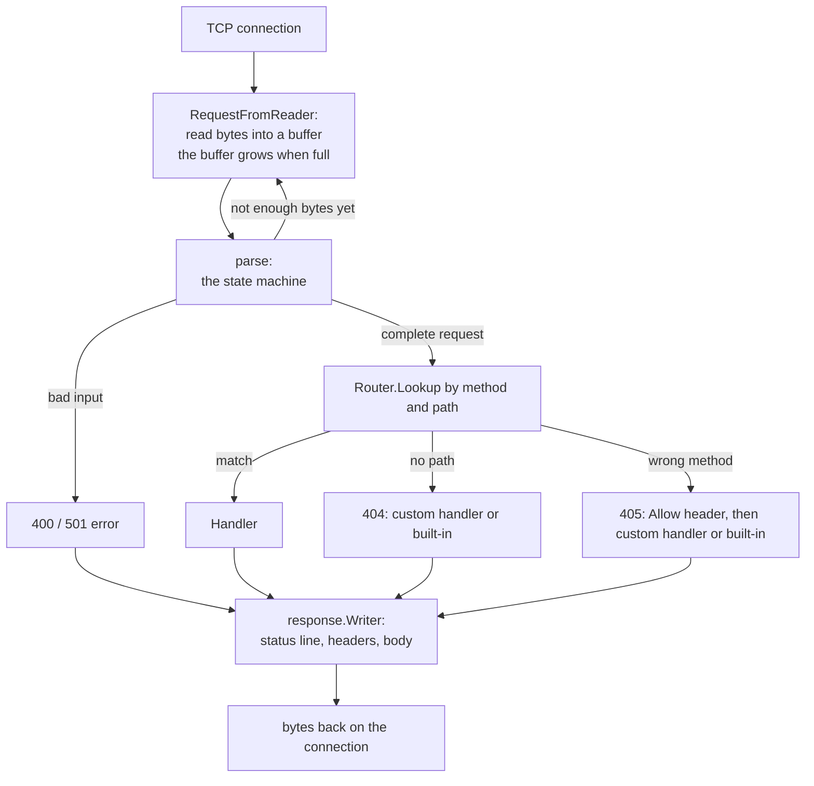
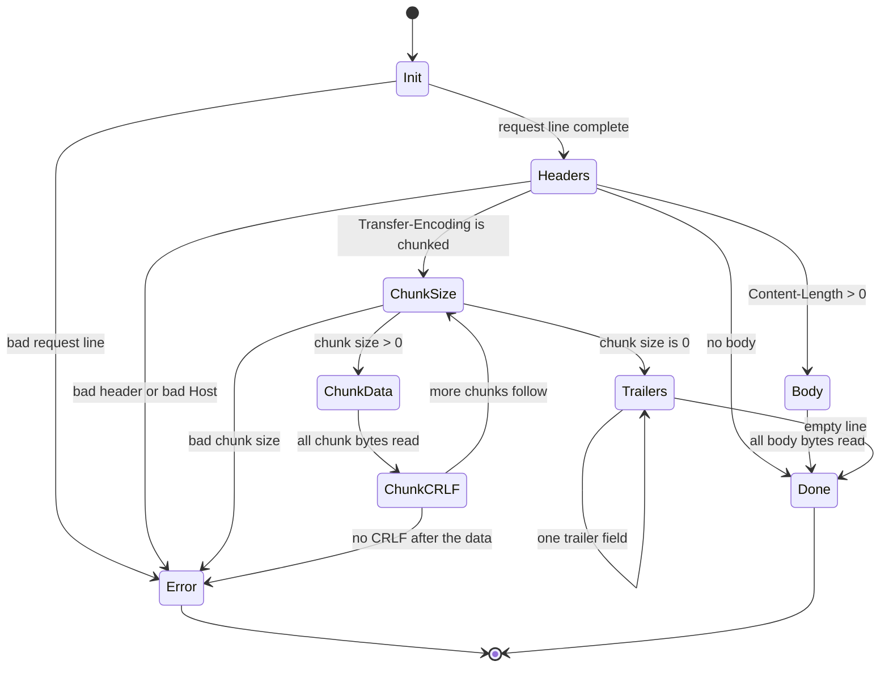

# httpfromtcp

[](https://github.com/rllko/httpfromtcp/actions/workflows/go.yml)

An HTTP/1.1 server that runs on raw TCP sockets. The project uses only the Go standard library. It has no external dependencies.

> **Note:** This is a project for study. Do not use this server in production.

## Contents

- [What the project does](#what-the-project-does)
- [Features](#features)
- [Getting started](#getting-started)
  - [Requirements](#requirements)
  - [Build the project](#build-the-project)
  - [Start the server](#start-the-server)
- [Usage](#usage)
  - [A minimal server](#a-minimal-server)
- [Architecture](#architecture)
  - [The flow of a request](#the-flow-of-a-request)
  - [The parser state machine](#the-parser-state-machine)
  - [The parser](#the-parser)
  - [The router](#the-router)
	- [Route errors](#route-errors)
	- [Error messages](#error-messages)
  - [Chunked transfer encoding](#chunked-transfer-encoding)
  - [Packages](#packages)
  - [Handler interface](#the-servers-handler-interface)
  - [Middleware](#middleware)
- [Run the tests](#run-the-tests)
- [AI usage](#ai-usage)
- [References](#references)

## What the project does

The server reads bytes from a TCP connection. The parser changes these bytes into an HTTP request. The router finds the correct handler for the request. The handler writes an HTTP response back to the connection.

The parser obeys RFC 9110 and RFC 9112. The parser accepts data in parts. A request can come in many small reads. The parser keeps its state between reads and continues where it stopped.

## Features

- HTTP/1.1 request parser with a resumable state machine
- Percent-decoding of the request target (RFC 3986 §2.1)
- Quoted-string parsing in header values (RFC 9110 §5.6.4)
- Header parameters, for example `text/html; charset=utf-8` (RFC 9110 §5.6.6)
- Host validation for IPv4, IPv6, and registered names (RFC 9110 §7.2)
- Chunked transfer encoding for request and response bodies (RFC 9112 §7.1)
- A trie router with static segments, `{name}` segments, and `*wildcard` segments
- Buffered response headers with an implicit commit on first body write
- A polynomial rolling hash for segment comparison, with a benchmark against a map
- A large test suite with split-read tests and malformed-input tests
- A middleware chain composed once at startup, wrapping the router's dispatch
- Registration errors that keep the method, the pattern, and the position of the fault
- Error messages with a source line and a `^` marker, in the style of the Rust compiler

## Getting started

### Requirements

- Go 1.26 or later

### Build the project

1. Get the source code.
2. Go to the project directory.
3. Run this command:

```sh
go build ./...
```

### Start the server

Run this command:

```sh
go run ./cmd/httpserver
```

The server starts on port 42069. Send a request to make sure that the server operates correctly:

```sh
curl http://localhost:42069/
```

## Usage

### A minimal server

```go
package main

import (
	"log"

	"httpfromtcp/internal/request"
	"httpfromtcp/internal/response"
	"httpfromtcp/internal/router"
	"httpfromtcp/internal/server"
)

func main() {
	r := router.New()

	r.Get("/", func(w response.Writer, req *request.Request) {
		w.Header().Set("Content-type", "text/plain")
		w.WriteBody([]byte("hello"))
	}).
	Get("/users/{id}", func(w response.Writer, req *request.Request) {
		id, _ := req.PathValue("id")
		w.WriteJSON(map[string]any{"id": id}, response.StatusOK)
	})


	// the router collects the registration errors. Examine them before you listen.
	if errs := r.Err(); len(errs) > 0 {
		for _, err := range errs {
			log.Println(err)
		}
		log.Fatal("the route table has errors")
	}

	srv, err := server.Serve(8080, r)
	if err != nil {
		log.Fatal(err)
	}
	defer srv.Close()
	select {}
}
```

The writer buffers headers. Set them in any order; the first `WriteBody`,
`WriteHeaders`, or `Error` call commits the status line and the header block.
A body write with nothing committed sends `200 OK`.

## Architecture

### The flow of a request

The diagram shows the path of one request, from the bytes on the socket to the response.


```mermaid
flowchart TD
    A[TCP connection] --> B[RequestFromReader:
    read bytes into a buffer
    the buffer grows when full]
    B --> C[parse:
    the state machine]
    C -->|not enough bytes yet| B
    C -->|bad input| E[400 / 501 error]
    C -->|complete request| F[Router.Lookup by method and path]
    F -->|match| G[Handler]
    F -->|no path| H[404: custom handler or built-in]
    F -->|wrong method| I[405: Allow header, then custom handler or built-in]
    G --> J[response.Writer:
    status line, headers, body]
    E --> J
    H --> J
    I --> J
    J --> K[bytes back on the connection]
```

### The parser state machine

Each state consumes the bytes it can and reports how many. The caller keeps the rest for the next read. This is how one request can arrive in many small pieces.


```mermaid
stateDiagram-v2
    [*] --> Init
    Init --> Headers: request line complete
    Headers --> Body: Content-Length > 0
    Headers --> ChunkSize: Transfer-Encoding is chunked
    Headers --> Done: no body
    Body --> Done: all body bytes read
    ChunkSize --> ChunkData: chunk size > 0
    ChunkSize --> Trailers: chunk size is 0
    ChunkData --> ChunkCRLF: all chunk bytes read
    ChunkCRLF --> ChunkSize: more chunks follow
    Trailers --> Trailers: one trailer field
    Trailers --> Done: empty line
    Init --> Error: bad request line
    Headers --> Error: bad header or bad Host
    ChunkSize --> Error: bad chunk size
    ChunkCRLF --> Error: no CRLF after the data
    Error --> [*]
    Done --> [*]
```

### The parser

The parser is a state machine with these states: request line, headers, body, done, error.

The parser accepts partial data. Each call to `parse` consumes the bytes that make complete parts. The parser returns the count of bytes that it consumed. The caller sends the bytes that remain in the next call.

The parser rejects these inputs and the server sends a `400` response:

- A malformed request line
- A method that is not a valid token
- A header name with illegal characters
- A `Content-Length` value that is not a sequence of digits
- Two `Content-Length` headers with different values
- A request target with an incomplete or invalid percent-escape
- A request target with an encoded NUL byte or an encoded slash
- A request without a `Host` header, or with two `Host` headers
- A `Host` header value that is not a valid host

The read buffer grows when a request is larger than its initial size. A large request does not stop the parser.

The server sends a `501` response for a `Transfer-Encoding` value that it does not know. The server accepts `chunked`. The server sends a `400` response if `chunked` is not the last coding, or if `chunked` occurs two times.

### The router

The router maps a route to a `router.Handler`, a function with the same shape as the server's handler. A successful lookup returns the handler and the captured segment values.

You register a route with a method and a path pattern. A path pattern has three types of segments:

| Segment type | Example  | What it matches                          |
| ------------ | -------- | ---------------------------------------- |
| Static       | `/users` | Only the exact text `users`              |
| Param        | `/{id}`  | One segment with any value               |
| Wildcard     | `/*path` | All the segments that remain in the path |

The router obeys these rules:

- A static segment wins against a param segment.
- A param segment wins against a wildcard segment.
- If a branch fails deeper in the path, the router goes back and tries the next segment type.
- A wildcard segment is legal only at the end of a pattern.
- The match result contains the values of the param and wildcard segments.

`Register` examines each pattern and returns an error for a bad one: a duplicate route, two names for one param position, a wildcard that is not at the end, or an empty segment. A bad route table stops the program at start, not with a wrong 404 later.

`Lookup` returns one of two errors when it does not find a handler. `ErrNotFound` means no method has the path (404). `ErrMethodNotAllowed` means a different method has the path (405). The `Allowed` function lists the methods for the `Allow` header of a 405 response.

Handlers read captured segments with `req.PathValue(name)`. The values are stored on the request, so concurrent requests never share them. The router
writes them just before it calls the handler.

The router is the server's handler. `Router.ServeHTTP` calls the middleware chain. The last element in the chain is `routeHTTP`. This method looks the route up, binds the parameters, and calls the matched handler. On `ErrNotFound` it calls the 404 handler. On `ErrMethodNotAllowed` it sets the `Allow` header and calls the 405 handler.

An application replaces either page with `r.NotFound(h)` and `r.MethodNotAllowed(h)`. Neither chains — a fallback is not a route. When you set neither, the router serves its own HTML pages. The `Allow` header is set by the router before it calls the 405 handler, so a replacement page cannot omit it.

`Get`, `Post`, `Put`, `Patch`, and `Delete` return the router so calls chain.
They do not return an error. Registration errors collect in the router; call
`Err()` before you start the listener.

The router also obeys these fixed decisions:
- `/a` and `/a/` are different paths. The router does not remove slashes.
- A param does not match an empty segment.
- A wildcard needs the slash: `/files/*path` matches `/files/` but not `/files`.
- Letter case is not important in a static segment. A param value and a wildcard value keep their letter case.

The router is a trie. Each node in the trie is one path segment. Two index types can hold the static segments of a node: a Go map (`New`) or a table that uses a polynomial rolling hash (`NewHashed`). When two hashes are equal, the table compares the full strings. This step prevents errors from hash collisions.

### Route errors

`Register` gives an error of the type `RouteError` when a pattern is not correct.
The error keeps six values: the sentinel error, the method, the pattern, the start
offset, the end offset, and a help text.

The two offsets are byte positions in the pattern. `Register` calculates them while
it walks the segments. It does not search the pattern a second time. A pattern that
repeats a segment gets the correct position.

`RouteError` has an `Unwrap` method. Thus `errors.Is` finds the sentinel through the
wrapper, and the code that examines the sentinels does not change:

```go
err := r.Register("GET", "/files/*path/edit", h)
errors.Is(err, router.ErrWildcardNotLast) // true
```

`Error` gives one line of text. Use this line in a log file. The `diagnostic`
package makes the large block. See the next section.

`Err` gives all the errors that the router collected. Use `errors.AsType` to
separate a `RouteError` from a different error.

### Error messages

The `internal/diagnostic` package writes an error message in the style of the Rust
compiler:

```
error: wildcard segment must be last
  --> main.go:170
  |
  | /httpbin/*path/edit
  |          ^^^^^
  |
  = help: wildcard segments must be the final segment
```

A `Diagnostic` value holds the message, the source line, the two offsets, the file
name, the line number, and the help text. The `Render` method makes the block.

The `^` characters show the part of the pattern that has the fault. The package
calculates their position from the two offsets. The gutter has the same width on
each line. Thus the `^` characters stay below the correct characters.

The `Underline` function limits the two offsets to the length of the source line.
A negative offset, an offset after the end of the line, and an end offset before the
start offset are all safe. The function does not stop the program.

The file name and the line number show the position of the call to `Get`, `Post`,
`Put`, `Patch`, or `Delete`. The router finds them with `runtime.Caller`. The line
number is available. The column number is not available, because only the Go
compiler reads the source text.

The `-->` line and the `= help:` line are optional. `Render` omits a line when its
value is empty.

### Chunked transfer encoding

The server reads and writes chunked bodies.

Each chunk has a hexadecimal size line, the data, and a CRLF. A chunk of size zero ends the body. Trailer fields can follow the last chunk. An empty line ends the trailer section.

The decoder is a state machine with four states: chunk size, chunk data, chunk CRLF, and trailers. The decoder continues across split reads. A read can stop at any byte, also in the middle of a size line or in the middle of the data.

The decoder removes chunk extensions from the size line. The decoder puts the decoded bytes in `Request.Body`. The decoder puts the trailer fields in `Request.Trailers`.

The response writer can write a chunked body. A chunked stream has two legal endings. Use one of them, not both:

```go
w.WriteChunkedBody(data)     // one chunk for each call; an empty slice does nothing
w.WriteChunkedBodyDone()     // ending 1: no trailers ("0" chunk + empty line)
w.WriteTrailers(trailers)    // ending 2: "0" chunk + trailer fields + empty line
```

Test the decoder with raw bytes:

```sh
printf 'POST / HTTP/1.1\r\nHost: localhost\r\nTransfer-Encoding: chunked\r\n\r\n3\r\ncat\r\n5\r\nhello\r\n0\r\n\r\n' | nc localhost 42069
```

### The server's handler interface

The server depends on one interface:

```go
type Handler interface {
	ServeHTTP(w response.Writer, req *request.Request)
}
```

`server.Serve` takes a port and a `Handler`. `*router.Router` implements the
interface, so an application registers its routes and passes the router:

```go
srv, err := server.Serve(8080, r)
```

A test that needs one handler and no route table uses `server.HandlerFunc`.
The type is a function with the handler's shape, and its `ServeHTTP` method
calls itself:

```go
type HandlerFunc func(w response.Writer, req *request.Request)

func (f HandlerFunc) ServeHTTP(w response.Writer, r *request.Request) {
	f(w, r)
}
```

This is the same adapter that `http.HandlerFunc` uses in the standard library.
A plain function becomes a `Handler` with a type conversion, not a new struct.

The server writes a response by itself in one case only: a request that the
parser rejected. The server sends the status that the parser chose, `400` for
a malformed request and `501` for a transfer coding it does not know.

After a successful parse the handler owns the whole response: the status line,
the headers, and the body. The server writes nothing after `ServeHTTP` returns.
A second write would put a second response on the same connection. The server
handles one request for each connection and then closes it.

### Middleware

A middleware takes a handler and returns a handler of the same type:

```go
type Middleware func(next Handler) Handler
```

The new handler runs code before it calls `next`. It also runs code after `next`
returns. The code before `next` can reject a request. The code after `next` can
examine the response. A middleware that does not call `next` ends the chain. No
handler below it runs.

`Use` adds a middleware. `Build` makes the chain:

```go
r := router.New()
r.Use(recovery).
	Use(logging).
	Get("/", rootEndpoint).
	Build()
```

The first `Use` wraps all the other middlewares. It reads the request first and
the response last. `Build` folds the slice in reverse order to keep this order.

The chain wraps the dispatch of the router. The chain does not wrap each
handler. `ServeHTTP` calls the chain. The last element in the chain is
`routeHTTP`. This method looks the route up, binds the parameters, and calls the
matched handler.

The router has two methods for one reason. One method cannot be the entry point
of the chain and also the last element of the chain. That is infinite recursion.

The chain wraps the dispatch. This has three results:

- A 404 response and a 405 response go through the chain. The lookup occurs in
  the last element. A request that matches no route runs each middleware first.
- A middleware applies to all the routes. You cannot apply a middleware to only
  one route or to only one subtree.
- A middleware does not know the matched route before it calls `next`. The
  router binds the parameters below it. After `next` returns, `req.PathValue`
  gives the values.

The router builds the chain one time, at start. Each connection shares the
router. Thus you write to the router at setup, and you only read the router
after that. `Use`, `NotFound`, and `MethodNotAllowed` after `Build` add an error
to the router. They do not change the chain. Call `Err()` before you listen.

A middleware that catches a panic must register the deferred function before it
calls `next`. A direct call to `recover` gives nil. A panic in `next` also skips
the lines after it:

```go
func Recovery(next router.Handler) router.Handler {
	return func(w *response.Writer, req *request.Request) {
		defer func() {
			if rec := recover(); rec != nil {
				w.Error(fmt.Sprintf("%v", rec), response.StatusInternalServerError, "text/plain")
			}
		}()
		next(w, req)
	}
}
```

### Packages

| Package             | What it contains                                        |
| ------------------- | ------------------------------------------------------- |
| `internal/request`  | The request parser and its state machine                |
| `internal/headers`  | The header map, quoted-strings, and header parameters   |
| `internal/url`      | Percent-decoding, the path/query split, host validation |
| `internal/response` | The buffered response writer                            |
| `internal/router`   | The trie router and the rolling hash                    |
| `internal/server`   | The TCP listener and the handler interface              |
| `cmd/httpserver`    | An example server                                       |
| `internal/diagnostic` | The error blocks with a source line and a `^` marker  |

## Run the tests

Run all the tests:

```sh
go test ./...
```

Run the tests with the race detector:

```sh
go test -race ./...
```

Run the benchmarks:

```sh
go test -bench . ./...
```

All tests pass, also with the race detector.

The test suite has these types of tests:

- Split-read tests: each parser test runs with many read sizes, from 1 byte per read and up.
- Malformed-input tests: each parser rejects bad input with an error, not with a panic.
- End-to-end tests: a real TCP client sends a request and examines the raw response.
- Differential tests: the map index and the hash index of the router must give equal answers.
- A collision test: two different segments with equal hashes must route to their own handlers.

## AI usage

This project is a study project. I wrote the code by hand. I used Claude as a tutor, not as a code generator.

**What the AI did:**

- It explained concepts: push-based against pull-based parsing, state machines, buffer compaction, and Go semantics such as labeled `break`.
- It named the bugs in my code and the inputs that cause them. It did not correct the bugs.
- It pointed me to the correct sections of RFC 9110, RFC 9112, and RFC 3986.
- It designed practice exercises. I built two toy parsers before the chunked decoder: a delimiter-framed number list and a length-prefixed word format.

**What the AI did not do:**

- It did not write the parser, the router, the response writer, or the tests.
- Tool writes are disabled in my configuration. The AI cannot edit the files in this repository.

**Why:** I want to learn the protocol at the byte level. Generated code does not teach that. Each bug in this repository is a bug that I found and corrected.

## References

- [RFC 9110 — HTTP Semantics](https://www.rfc-editor.org/rfc/rfc9110)
- [RFC 9112 — HTTP/1.1](https://www.rfc-editor.org/rfc/rfc9112)
- [RFC 3986 — URI: Generic Syntax](https://www.rfc-editor.org/rfc/rfc3986)
